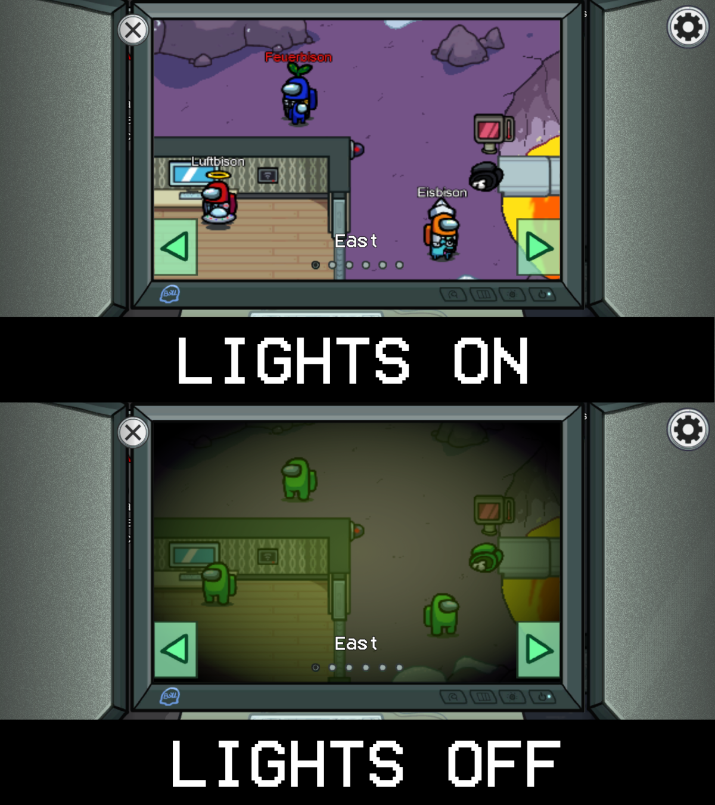

# Night Vision Camera
A BepInEx mod that switches the surveillance cameras to night vision when the lights are out in Among Us.

# What does the mod add?
 
When the lights are off in Among Us, all surveillance cameras will switch to night vision.
In the night vision camera all players and dead bodies look the same.

# Dependency

Install [vc_redist](https://aka.ms/vs/16/release/vc_redist.x86.exe)

# Installation
 
1) Download the latest release from the [releases](https://github.com/Eisbison/AmongUsNightVisionCamera/releases) tab.
2) Drag the files from the zip into your Among Us game folder
3) Run the game

If you're already using other BepInEx mods, just add the files NightVisionCamera-2020.12.9s.dll and Essentials-2020.12.9s.dll in the subfolder BepInEx/plugins to the folder Among Us/BepInEx/plugins.

# Resources
https://github.com/NuclearPowered/Reactor The framework the mod uses.  
https://github.com/BepInEx For hooking game functions.  
https://github.com/DorCoMaNdO/Reactor-Essentials For creating custom game options easily.